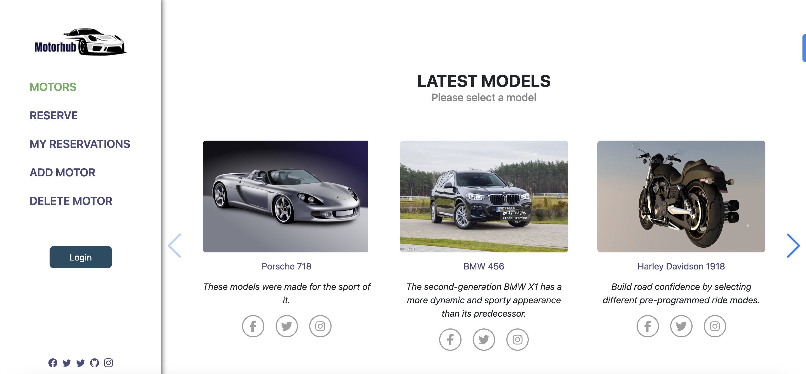

<a name="readme-top"></a>

<div align="center">

  <br/>
  <h1>Motorhub</h1>

</div>

## 📗 Table of Contents

- [📖 About the Project](#about-project)
  - [Schema](#ER-diagram)
  - [🛠 Built With ](#-built-with-)
  - [Tech Stack ](#tech-stack-)
  - [Key Features ](#key-features-)
  - [🚀 Live Demo](#live-demo)
- [💻 Getting Started ](#-getting-started-)
  - [Prerequisites](#prerequisites)
  - [Setup](#setup)
  - [Install](#install)
  - [Run Tests](#run-tests)
  - [👥 Authors ](#-authors-)
- [🔭 Future Features:](#-future-features)
  - [🤝 Contributing ](#-contributing-)
  - [⭐️ Show your support ](#️-show-your-support-)
  - [🙏 Acknowledgments ](#-acknowledgments-)
  - [📝 License ](#-license-)

<!-- PROJECT DESCRIPTION -->

# Motorhub <a name="about-project"></a>

The Motorhub - Online Motor Reservation System is a web application designed to provide users with the ability to reserve, view, and manage motors such as cars and bikes reservation for purchases. The system aims to streamline the process of finding and booking motors from various locations, making it convenient for both users and motor providers.


  ```json
email: motor@testmail.com
password: 123456
```
<!-- ER diagram"-->

#### Link to [Backend](https://github.com/binodbhusal/motorhub_backend.git)

## 🛠 Built With <a name="built-with"></a>

### Tech Stack <a name="tech-stack"></a>

<details>
  <summary>Framework</summary>
  <ul>
    <li><a href="https://react.dev/">React</a></li>
    <li><a href="https://redux.js.org/">Redux</a></li>
    <li><a href="https://reactrouter.com/en/main">React Router</a></li>
    <li><a href="#">CSS/TailwindCSS</a></li>
  </ul>
</details>

<!-- Features -->

### Key Features <a name="key-features"></a>

1. User Authentication: The system allows users to create accounts and log in
2. Motors Listings: Motors providers can list their available motors. Each listing includes details such as the brand, model, manufacturer, price, description, and location.
3. Reservation Management: Users can view available motors at different locations and make reservations
4. Add and delete motors in including location

<p align="right">(<a href="#readme-top">back to top</a>)</p>

## 🚀 Live Demo <a name="live-demo"></a>


 Click on this [Motorhub Live Demo](https://motorhub.netlify.app/) to view the live-demo of project

<p align="right">(<a href="#readme-top">back to top</a>)</p>

<p align="right">(<a href="#readme-top">back to top</a>)</p>

<!-- GETTING STARTED -->

## 💻 Getting Started <a name="getting-started"></a>

### Prerequisites

In order to run this project you need:

- Installed Git.
- Installed React
- Installed Redux
- Create a local directory that you want to clone the repository.
- Open the command prompt in the created directory.
- On the terminal run this command git clone https://github.com/binodbhusal/motorhub_frontend.git

### Setup

Clone this repository to your desired folder:

```sh
git clone https://github.com/binodbhusal/motorhub_frontend.git
```

```sh
cd final_capstone_frontend
```

````

```sh
npm install
````

```sh
npm start
```

### Run Tests

npm test

<p align="right">(<a href="#readme-top">back to top</a>)</p>

<!-- AUTHORS -->

## 👥 Authors <a name="authors"></a>

### 👤 **Binod Bhusal**

- GitHub: [@binodbhusal](https://github.com/binodbhusal)
- Twitter: [@twitter](https://twitter.com/Binod_ironLad)
- LinkedIn: [@linkedin](https://www.linkedin.com/in/binodbhusal/)

### 👤 **Dieum Akonkwa**:

- GitHub: [@dieum512](https://github.com/dieum512)
- Twitter: [@twitter](https://twitter.com/dieumakonkw)
- LinkedIn: [@linkedin]()

### 👤 **Salomon Tshobohwa**:

- GitHub: [@Tshobohwa ](https://github.com/Tshobohwa)
- LinkedIn: [@linkedin](https://www.linkedin.com/in/tshobohwasalomon/)

### 👤 **Alijan Rahimi**

- GitHub: [@rahimialijan](https://github.com/rahimialijan)
- Twitter: [@twitter](https://twitter.com/AlijanRahimi10)
- LinkedIn: [@linkedin](https://www.linkedin.com/in/alijan-rahimi-18389ab3/)

# 🔭 Future Features:

- Implement Authorization

## 🤝 Contributing <a name="contributing"></a>

Contributions, issues, and feature requests are welcome!

Feel free to check the [issues page](https://github.com/binodbhusal/motorhub_frontend/issues).

<p align="right">(<a href="#readme-top">back to top</a>)</p>

<!-- SUPPORT -->

## ⭐️ Show your support <a name="support"></a>

If you liked this project, give it a ⭐️ and kindly send to me an e-mail expressing it, it would make our day and fuel our motivation.

<p align="right">(<a href="#readme-top">back to top</a>)</p>

<!-- ACKNOWLEDGEMENTS -->

## 🙏 Acknowledgments <a name="acknowledgements"></a>

Hats off to Murat Korkmaz for designing the awesome template that was used. ✨
Microverse for giving us this chance
The amazing code reviewers for making us improve every day 👍

Original design idea by [Murat Korkmaz on Behance](https://www.behance.net/gallery/26425031/Vespa-Responsive-Redesign).

<p align="right">(<a href="#readme-top">back to top</a>)</p>

<!-- LICENSE -->

## 📝 License <a name="license"></a>

This project is [MIT](./LICENSE) licensed.

<p align="right">(<a href="#readme-top">back to top</a>)</p>
